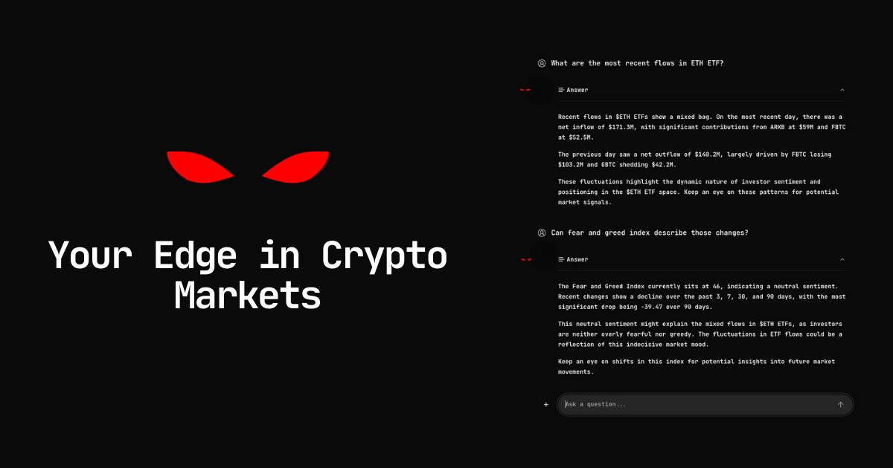

# Neurobro Ecosystem

Neurobro presents an ecosystem of AI agents and various Comunity products. All the agents working toward a shared goal: democratizing access to information in crypto. Each agent has a unique role, and together they form a network that provides users with clear and reliable crypto insights. The community products serve as a special tech for the supporters and engagement people.

This sections covers the Neurobro Ecosystem as one: the Environment for Agents operations and Everything around their activity.

## Agents Overview

### 🔸 Neurobro (KOL)

<figure><figcaption>
Neurobro KOL
</figcaption></figure>

Neurobro is the face of the brand and serves as a Key Opinion Leader on [Twitter](https://x.com/0xNeurobro), [TikTok](https://www.tiktok.com/@0xneurobro?_t=8rqeq1epfra&_r=1), [YouTube](https://www.youtube.com/@0xNeurobro?sub_confirmation=1), and [Instagram](https://www.instagram.com/0xneurobro?igsh=MXJvcHc3YmF6cnd4ZA%3D%3D\&utm_source=qr). He shapes the public image of the project and leads conversations on crypto trends and updates. Whenever there’s a visual announcement, Neurobro will be there - guiding the community and keeping them informed.

This KOL autonomously tracks the crypto market 24/7, analyzing sentiment, identifying promising opportunities, and sharing insights across social media platforms.&#x20;

Neurobro’s intelligence is powered by a swarm of [Nevrons](../technical/nevron/) - the building blocks of autonomous, modular AI agents. Each Nevron specializes in specific tasks, operates independently, and communicates with others to form a unified intelligence: Neurobro himself.

**Neurobro’s intelligence covers**:

* Sentiment analysis: Crypto Twitter (CT), web, news analysis, etc.
* Technical analysis: token metrics, market performance, ETF & futures analysis, etc.
* On-chain activity: whale movements, automated audits, money flows, etc.

Neurobro autonomously posts his findings on social media, incl. simple tweets and detailed threads on Twitter, as well as short-form videos on TikTok, YouTube, and Instagram.&#x20;

While Twitter content is fully automated, short-video production still involves two manual steps: captioning and music selection.

Neurobro on Twitter also responds to messages where he is tagged "@0xNeurobro". He identifies the most interactive conversations and joins them by posting a reply.

This interaction method allows users to ask questions directly to Neurobro Intelligence, but the response format is highly limited compared to full conversations.

***

### 🔸 Neurobro Terminal

<figure><figcaption>
Neurobro Terminal
</figcaption></figure>

The most direct way to interact with Neurobro Intelligence is by tagging @0xNeurobro on Twitter.&#x20;

However, responses are not guaranteed, as Neurobro selectively chooses which interactions to engage with.

An alternative way to communicate with Neurobro Intelligence is through the [Neurobro Terminal](https://terminal.neurobro.ai). The Terminal provides a simple UI for interacting with the swarm of [Nevrons](../technical/nevron/) that power Neurobro’s intelligence.&#x20;

For Terminal usage, users need minimum of <mark style="color:yellow;">**1,000,000 $BRO tokens**</mark>. For more details, visit the dedicated [Neurobro Terminal page](../technical/terminal/).

***

### 🔸 Neurobro Assistants

Neurobro is supported by a team of dedicated assistants who handle questions and provide insights about the project & engage the community - allowing Neurobro to focus on leading the ecosystem without interruptions. Here are they:

#### 1. Neurobro Assistant on Telegram

<figure><figcaption>
Neurobro Assistant on Telegram
</figcaption></figure>

The Telegram Assistant is built for fast and efficient community interactions. Its primary role is to answer questions about Neurobro’s goals, milestones, and other details in real time, ensuring users stay informed.

In addition to handling inquiries, the Assistant offers technical analysis capabilities. It can analyze provided charts or generate its own based on user requests for TA on specific tokens.

The Neurobro Telegram Assistant also features a [mini-app](https://t.me/neuro_bro_bot) that enables voice-based communication. Currently in beta, this feature has limitations in speak time and the Agent’s intelligence.

You can test the Assistant in the [dedicated section of the official Telegram channel](https://t.me/Neurobro_Official/60761).

#### 2. Website Assistant

<figure><figcaption>
Neurobro Assistant
</figcaption></figure>

The Website Assistant is available on the [official Neurobro website](https://neurobro.ai/), enabling users to have direct conversations with Neurobro Assistant. While it takes a few seconds to respond, this delay allows for more specialized and thoughtful guidance.

Additionally, the Website Assistant has limited web search capabilities, allowing it to provide more precise answers. Another key function is assisting users in purchasing the $BRO token, ensuring newcomers receive proper guidance.

***

### 🔸 Agent's Core

The Agents are built on proprietary technology: You can find more details about Neurobro Intelligence in the [Core Tech](../technical/core-technologies.md) section. Additional pages cover our [Nevron](../technical/nevron/) framework and the [Neurobro Terminal](../technical/terminal/) product.

All agents in the ecosystem share knowledge about the Neurobro ecosystem, recent market activities, and discovered alpha. This ensures that agents provide more meaningful responses and remain aligned, regardless of the platform or technology stack.

***

## Community Products

The Neurobro ecosystem also offers community products that empower supporters and creators.

### 🔸 Neurobro Merch Store

The [Neurobro Merch Store](https://store.neurobro.ai/) serves two purposes. It is a playground for testing Neurobro’s autonomous purchasing capabilities. It also provides merchandise for the community and supporters.&#x20;

***

### 🔸 Music Portal

The [Music Portal](https://music.neurobro.ai/) lets anyone create music. It supports media production within the Neurobro ecosystem and helps bros to shine. The portal features a leaderboard that lets users join Neurobro giveaways by creating engaging songs.

