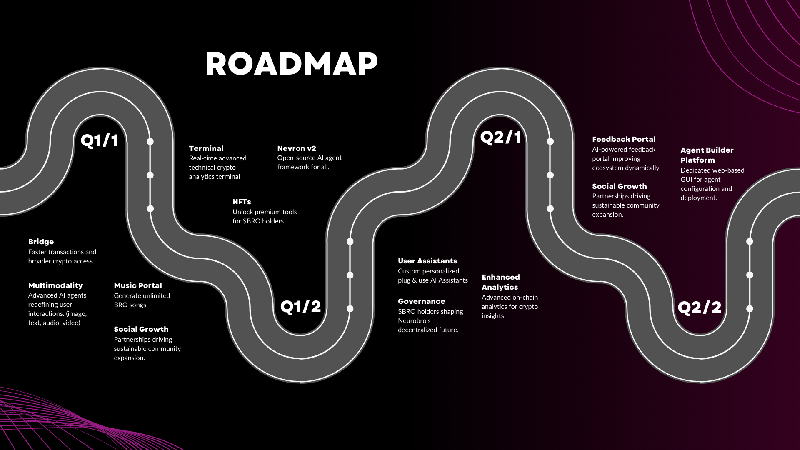

# Roadmap

At Neurobro, we’re not just riding the wave of progress - we’re reshaping the current.&#x20;

Our vision for the future stands on two key pillars:

1. **Building Smarter Agents**: We're developing AI agents that don’t just analyze the crypto world - they make sense of it and provide clear and actionable insights
2. **Building a Stronger Community**: Beyond workflows, agents & tools - we're creating a space where every user has a seat at the table, helping to shape the Neurobro ecosystem into the future of decentralized intelligence

<figure><figcaption>
Neurobro Q1-Q2 Roadmap
</figcaption></figure>

The road ahead isn't just about technology or people - it's about the fusion of both. Below, we break down the bold moves we're planning to make to bring this vision to life:

***

### 🔸 Building Smarter Agents

Our innovation roadmap pushes the boundaries of AI and crypto integration - delivering tools to revolutionize decentralized intelligence:

**📍 Terminal**

A dedicated terminal offering crypto analytics for $BRO holders - empowering them with actionable real-time, on-chain crypto data insights, providing detailed, unbiased technical analyses of projects in seconds.

**📍 Nevron**

Elevating [Nevron](../technical/nevron/) to the forefront of open-source AI and roll out **v2** - making it a go-to open-source AI agent framework with a user-friendly portal for seamless exploration, development, and application. More about Nevron's roadmap [here](../technical/nevron/roadmap.md).

📍 **Multimodality**

Integrating advanced multimodal capabilities across all AI agents:

* **Image-to-Text**
* **Text-to-Image**
* **Voice-to-Text**
* **Voice-to-Voice**
* **Text-to-Video**

Redefining user interaction and insights, positioning Neurobro as the leader in truly multimodal AI agents.

📍 **Exclusive NFTs**

Launching NFTs that unlock access to exclusive AI-powered applications, features, and tools like music generation for $BRO token holders.

📍 **Bridge to other chains**

Developing a seamless bridge to other blockchains (like Solana) - enabling faster transactions, lower fees, and broader access for $BRO holders and AI agents.

📍 **Social Media Crypto Adoption**

Promoting crypto adoption with engaging content on TikTok, Instagram, and more. Enabling Neurobro to autonomously join and actively participate in Discord and Twitter Spaces.

📍 **Personalized AI Assistants**

Providing every $BRO token holder with a personalized assistant featuring persistent memory for customized insights and ongoing support.

📍 **Enhanced On-Chain Analytics**

Doubling down on advanced on-chain analytics - delivering deeper transparency and actionable data to users through robust tools and reports.

***

### 🔸 Building a Stronger Community

Our Community Growth Roadmap focuses on empowerment, collaboration, and inclusivity to create a thriving, participatory ecosystem:

📍 **Decentralized Governance**

Enabling $BRO holders to participate in decentralized governance - giving the community a direct voice in shaping Neurobro's future.

📍 **Agent Builder Platform**

Empowering KOLs, entrepreneurs and developers with tools to create, customize, and deploy their own AI agents, expanding the reach and utility of the Neurobro ecosystem based on top of [Nevron](../technical/nevron/) framework and promote innovation and collaboration.

📍 **Social Engagement**

Keep building high-quality, long-term partnerships with key opinion leaders through Twitter, Discord, Instagram, and YouTube to drive consistent and sustainable community growth.

**📍 Feedback Portal**

Launching an AI-powered feedback portal - allowing all users to report issues, hallucinations, propose improvements, and track updates in real time. It will analyze feedback, prioritize tasks, and implement fixes instantly when feasible, creating a more dynamic and responsive Neurobro ecosystem.

***

Neurobro's journey is rooted in a deep-seated belief that **innovation and community development** go hand in hand.&#x20;

As we roll out each feature, we simultaneously strengthen our **community growth initiatives -** integrating user feedback, refining existing services, and cultivating an ecosystem where all participants can prosper.

By placing equal importance on both groundbreaking technological advancements and robust community engagement, Neurobro is setting a new standard in the crypto

Together, we are creating the future of decentralized crypto intelligence.
