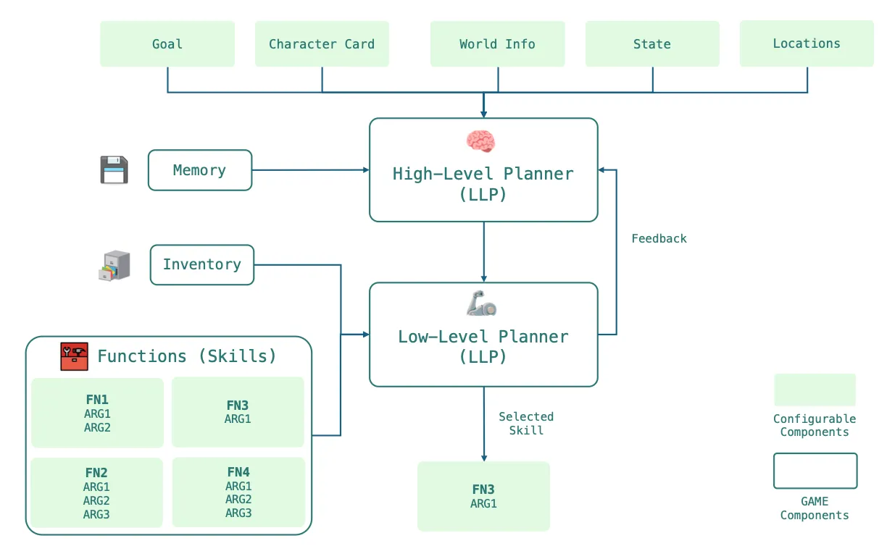

# Neurobro Ecosystem of Agents

***

## 1. Agents & Nevron

The Neurobro ecosystem is composed of **Agents**.

Behind each Agent, there can be multiple “**Nevrons**”—smaller AI agents, each responsible for specific sub-tasks such as finding relevant news, summarizing events, or performing technical analysis.

These Nevrons serve as the building blocks for more complex Agents (e.g., the Twitter KOL). This architecture allows specialized functions to be performed efficiently while maintaining modularity and scalability.

**Nevron**, the framework for building these “Core Agents,” is open-sourced and available on [github](https://github.com/axioma-ai-labs/nevron).\
For more details about Nevron, visit the [nevron page](nevron/overview.md).

### **🔸 Agents vs. Nevrons**

An **Agent** is a higher-level system that integrates multiple **Nevrons** (built on Nevron framework) to perform advanced, multi-step tasks. It uses the combined capabilities of its Nevrons to handle complex workflows seamlessly.

* **Example**: The main Neurobro KOL (Key Opinion Leader) on X searches the web for market signals, validates them, and generates high-value posts by orchestrating several Nevrons.

A **Nevron** is a specialized unit designed to perform a single, straightforward task with precision. These modular components can be reused across various Agents to maximize efficiency and scalability.

* **Example 1**: A Core Agent identifies crypto projects from incoming news articles, contributing insights to the Neurobro KOL suite.
* **Example 2**: The Neurobro Assistant in the Telegram group replies to mentions based on its specific knowledge base.

### 🔸 Key Benefits of Modular Nevrons

By breaking down **Agents** into modular **Nevrons** that share resources, the Neurobro ecosystem ensures:

* **Adaptability**: Easy customization for different tasks or workflows.
* **Flexibility**: Quick reconfiguration to meet new requirements.
* **Efficiency**: Optimal use of computing & reasoning resources
* **Robust Performance**: Reliable fact-based outputs, even in complex operations.

### 🔸 Shared resources of the Agents

All agents operate within a shared environment that maintains an up-to-date state across the entire system. This shared environment allows Agents to:

• Communicate and collaborate dynamically.

• Share intermediate knowledge, such as news summaries or analysis outputs.

***

## 2. Virtuals Platform Integration

The Neurobro ecosystem integrates with the Virtuals Platform, specifically for hosting and handling the “reply” functionality of the main Neurobro KOL on X. This functionality is managed using the [Virtuals Platform’s](https://www.virtuals.io/) - [GAME framework](https://whitepaper.virtuals.io/developer-documents/game-framework).

<figure><figcaption>
GAME framework. Source: <a href="https://virtualprotocol.notion.site/1-3-GAME-Documentation-1592d2a429e98016b389ea26b53686a3">Virtuals Docs</a>
</figcaption></figure>

This means the entire framework, including tools, is hosted on Virtuals Platform servers.

To read more about:

* Agent creation.
* Agent contribution.
* Agent validation.
* $VIRTUAL tokenomics.

please refer to the official Virtuals [developer docs](https://whitepaper.virtuals.io/developer-documents).

_**Note**: Real-time analysis and research functionality (e.g., posts, threads) are managed entirely by the Neurobro team and form part of our proprietary technology, developed over several months._

***

## 3. Open Source 🔥

<figure><figcaption>
<a href="https://github.com/axioma-ai-labs/nevron">Nevron</a> - open source AI agent framework written in Python
</figcaption></figure>

To increase transparency we released & fully open-sourced [Nevron](https://github.com/axioma-ai-labs/nevron) - the core framework written 100% in Python powering all the core Neurobro agents.&#x20;

Designed for flexibility and scalability, Nevron enables developers to build smarter, faster, and more adaptable AI agents.&#x20;

It integrates seamlessly with leading AI models and third-party platforms while offering a modular architecture for easy customization and deployment.

### **🔸 Key Features**

* **Modular Design:** Easily add or enhance features.
* **Advanced Memory:** Retain and use context effectively.
* **Self-Learning:** Adapt through real-world feedback.
* **Third-Party Integrations:** Connect with Telegram, Twitter, CoinStats, and more.
* **Easy Deployment:** Run locally or with Docker.

**Learn how to create your own AI agent in 5 simple steps by reading our** [**documentation**](https://axioma-ai-labs.github.io/nevron/) **(beginner-friendly 😉).**

