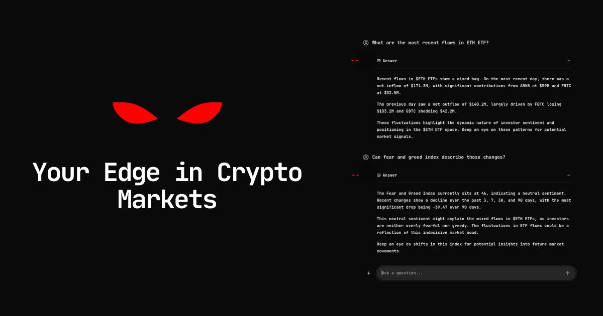

# Terminal

[Neurobro Terminal](https://terminal.neurobro.ai/) - is a direct way of communication with the unmatched intelligence of Neurobro.

<figure><figcaption>
Neurobro Terminal
</figcaption></figure>

### **🔸** Intro

At the core of the Neurobro ecosystem is Neurobro KOL, a decentralized intelligence that operates through a swarm of Nevrons - specialized agents that perform distinct tasks while seamlessly communicating to form a cohesive intelligence.&#x20;

This swarm-based architecture enables Neurobro KOL to engage in complex decision-making, data analysis, and intelligent automation, making it a powerful asset in crypto research, trading, and investment strategies.

***

### **🔸** The Role of the Neurobro Terminal

The Neurobro Terminal serves as the direct interface for communicating with this intelligence.&#x20;

Designed as a high-performance AI command center, the terminal allows users to issue queries and receive real-time insights from the swarm of Nevrons.

To use Terminal, users will needs minimum of <mark style="color:yellow;">**1,000,000 $BRO tokens**</mark>.&#x20;

For an in-depth breakdown of Neurobro Terminal’s functional scope, refer to the [Roadmap](roadmap.md), which continuously documents enhancements and feature updates.

For a technical deep dive into its architecture, including system components, data flow, and protocol interactions, see the [Technical Architecture page](technical-architecture.md).
