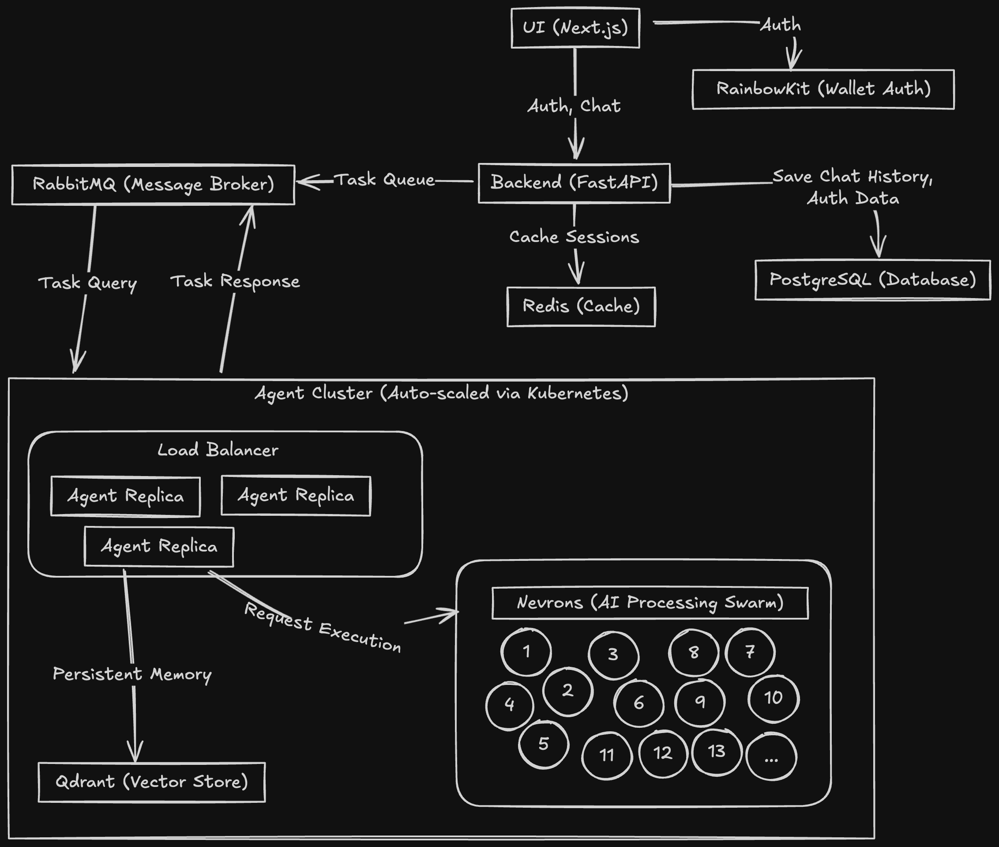

# Technical Architecture

### **🔸** Introduction

Building a high-performance, low-latency UI for the Neurobro Agent service presents significant technical challenges.&#x20;

Neurobro’s intelligence is powered by a dynamic swarm of specialized AI processes that coordinate efficiently to deliver intelligent responses.&#x20;

To ensure scalability and responsiveness under high concurrency, our architecture is designed to efficiently distribute workloads, manage state, and optimize inter-service communication.

***

### **🔸** System Architecture

The Neurobro Terminal comprises three primary services:

* **Neurobro UI** - A Next.js frontend handling user interactions.
* **Neurobro Backend** - A FastAPI service responsible for authentication, user session management, and message routing.
* **Neurobro Agent** - The core intelligence service that processes user queries and executes workflows.

The Agent service orchestrates a swarm of Nevrons, each executing specialized tasks.

<figure><figcaption>
Terminal Architecture Overview
</figcaption></figure>

### **🔸** Communication Flow

1. A user submits a request via the UI, which is sent over HTTPS to the backend.
2. The backend authenticates the user and forwards the request to the RabbitMQ Task Queue.
3. The Agent service retrieves tasks from RabbitMQ, executes workflows within the Nevrons ecosystem (e.g., `nevron7`: market analysis, `nevron31-33`: technical analysis, `nevron12-17`: research), and streams responses back.
4. The backend receives updates and forwards them to the UI via HTTPS streaming for real-time interaction.

***

### **🔸** Core Technologies

* **Message Broker:** RabbitMQ
* **Database:** PostgreSQL
* **Cache:** Redis
* **Vector Store:** Qdrant

***

### **🔸** Detailed Service Breakdown

#### 1. Neurobro UI (Frontend)

* Built with **Next.js** for server-side rendering (SSR) and performance optimization.
* Establishes an **HTTPS** connection to the backend for real-time communication using **streaming responses**.
* Renders task progress, streaming updates, and final outputs.
* Implements **wallet authentication** via **RainbowKit**.
* Securely stores **JWT tokens** for session management.

#### 2. Neurobro Backend

* Developed with **FastAPI** for high-performance request handling.
* Manages **wallet authentication**, **JWT issuance**, and **session validation**.
* Routes user messages to the **RabbitMQ Task Queue**.
* Listens for **Agent responses** via the RabbitMQ Response Queue and forwards them to the frontend.
* Implements **rate limiting** and **access control** to prevent abuse.
* Integrates with **PostgreSQL** and **Redis** for data storage and retrieval.

#### 3. Neurobro Agent (Core Intelligence)

* Runs as **multiple containerized replicas**, ensuring efficient handling of concurrent queries.
* Executes **workflow-based tasks** by interacting with Nevrons.
* Streams **real-time results** back via RabbitMQ.

#### 4. Nevrons

* Represent an **ecosystem of AI-driven processes**, each specializing in a particular task (e.g., market data analysis, scam detection, airdrop monitoring, etc.).
* Integrate **LLMs** and external APIs.
* Maintain **persistent memory** for long-term contextual understanding.

For more information about Nevrons please read the [official documentation](../nevron/) as well as our [roadmap](../nevron/roadmap.md).

***

### **🔸** Scalability & Performance Optimizations

RabbitMQ distributes workloads across instances to prevent any single one from becoming overloaded.&#x20;

As seen in the architecture diagram, multiple agent replicas allow the system to automatically scale during periods of high traffic.&#x20;

A persistent message history enhances the user experience by reducing redundant requests. Additionally, HTTPS-based streaming updates ensure low-latency interactions.

***

### **🔸** Conclusion

The Neurobro Terminal delivers a highly scalable, low-latency architecture for interacting with Neurobro AI intelligence.&#x20;

Its event-driven design ensures responsiveness, even under high user load.&#x20;

The separation of concerns between UI, Backend, and Agent services enables independent scaling and future enhancements.
